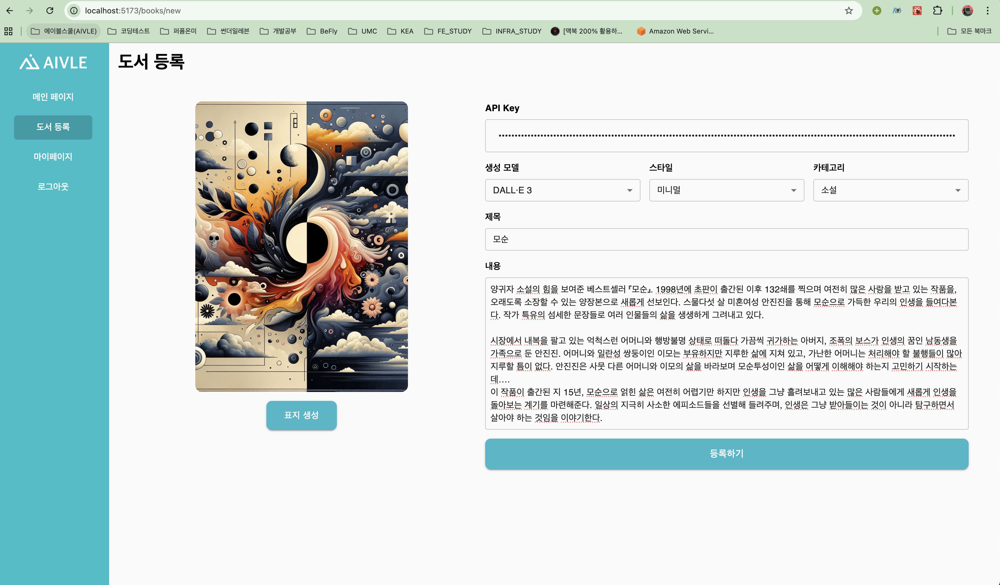
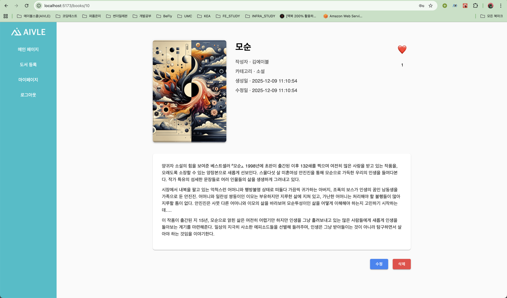
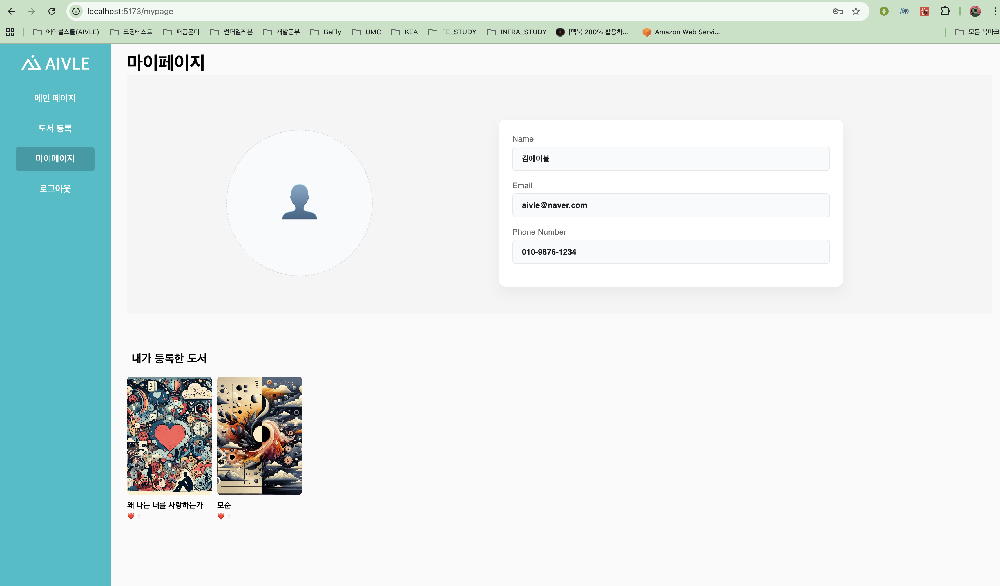

# 📚 도서 관리 시스템 (Book Management System)

React와 Spring Boot를 활용한 풀스택 도서 관리 웹 애플리케이션입니다. 사용자가 도서를 등록하고, 카테고리별로 조회하며, AI를 활용한 표지 이미지를 생성할 수 있습니다.

---

## 🎯 프로젝트 개요

이 프로젝트는 도서 정보를 관리하고 공유할 수 있는 웹 애플리케이션입니다. 사용자는 도서를 등록하고, OpenAI DALL·E API를 활용하여 자동으로 표지 이미지를 생성할 수 있습니다.

### 주요 기능
- 도서 CRUD (생성, 조회, 수정, 삭제)
- AI 기반 도서 표지 자동 생성 (OpenAI DALL·E)
- 좋아요 기능 및 인기 도서 랭킹
- 카테고리별 필터링 및 정렬
- JWT 기반 사용자 인증
- 마이페이지 (사용자별 도서 관리)

---

## 📸 화면

<table>
<tr>
<td width="50%">
<strong>메인 페이지</strong><br>

</td>
<td width="50%">
<strong>도서 등록 페이지</strong><br>

</td>
</tr>
<tr>
<td width="50%">
<strong>도서 상세 페이지</strong><br>

</td>
<td width="50%">
<strong>마이페이지</strong><br>

</td>
</tr>
</table>

---

## 🏗️ 프로젝트 구조

```
mini-4/
├── frontend/              # React 프론트엔드
│   ├── src/
│   │   ├── component/     # 재사용 컴포넌트
│   │   ├── pages/         # 페이지 컴포넌트
│   │   ├── services/     # API 서비스 레이어
│   │   └── layout/        # 레이아웃
│   ├── package.json
│   └── README.md          # 프론트엔드 상세 문서
│
└── COVERGEN-BACKEND/      # Spring Boot 백엔드
    ├── src/main/java/
    │   └── com/aivle/spring/
    │       ├── domain/    # JPA 엔티티
    │       ├── repository/ # 데이터 접근 계층
    │       ├── service/   # 비즈니스 로직
    │       ├── web/       # 컨트롤러 및 DTO
    │       ├── config/    # 설정 (CORS, Security)
    │       └── jwt/      # JWT 인증
    ├── build.gradle
    └── README_back.md     # 백엔드 상세 문서
```

---

## 🛠️ 기술 스택

### Frontend
| 기술 | 버전 | 용도 |
|------|------|------|
| React | 19 | UI 라이브러리 |
| Vite | 7 | 빌드 도구 및 개발 서버 |
| React Router | 7 | 클라이언트 사이드 라우팅 |
| Material-UI | 7 | UI 컴포넌트 라이브러리 |
| Axios | 1.13 | HTTP 클라이언트 |
| react-slick | 0.31 | 슬라이더 컴포넌트 |

### Backend
| 기술 | 버전 | 용도 |
|------|------|------|
| Java | 17 | 프로그래밍 언어 |
| Spring Boot | 3.x | 웹 프레임워크 |
| Spring Data JPA | - | ORM 및 데이터 접근 |
| H2 Database | - | 인메모리 데이터베이스 (개발용) |
| Gradle | - | 빌드 도구 |
| Lombok | - | 보일러플레이트 코드 제거 |
| JWT | - | 인증 토큰 |

### 외부 API
- **OpenAI DALL·E API**: 도서 표지 이미지 생성

---

## 🚀 빠른 시작

### 필수 요구사항
- **Node.js** 18 이상
- **Java** 17 이상
- **npm** 또는 **yarn**
- **Gradle** (또는 Gradle Wrapper)

### 1. 프로젝트 클론

```bash
git clone <repository-url>
cd mini-4
```

### 2. 백엔드 실행

```bash
cd COVERGEN-BACKEND
./gradlew bootRun
# 또는 Windows의 경우
gradlew.bat bootRun
```

백엔드 서버는 `http://localhost:8080`에서 실행됩니다.

### 3. 프론트엔드 실행

새 터미널에서:

```bash
cd frontend
npm install
npm run dev
```

프론트엔드 개발 서버는 `http://localhost:5173`에서 실행됩니다.

### 4. 브라우저 접속

브라우저에서 `http://localhost:5173`으로 접속하여 애플리케이션을 사용할 수 있습니다.

---

## 📡 API 엔드포인트 개요

### 인증
- `POST /users/signup` - 회원가입
- `POST /users/login` - 로그인

### 도서
- `GET /books` - 도서 목록 조회 (쿼리: `category`, `sort`)
- `GET /books/popular` - 인기 도서 TOP 10
- `GET /books/:id` - 도서 상세 조회
- `POST /books` - 도서 등록
- `PUT /books/:id` - 도서 수정
- `DELETE /books/:id` - 도서 삭제
- `POST /books/:id/likes` - 좋아요 추가
- `DELETE /books/:id/likes` - 좋아요 취소

> 📌 상세한 API 명세는 백엔드 README를 참고하세요.

---

## 🔧 환경 설정

### 프론트엔드
백엔드 서버 주소는 `frontend/src/services/api.js`에서 설정합니다:
```javascript
baseURL: "http://localhost:8080"
```

### 백엔드
CORS 설정은 `COVERGEN-BACKEND/src/main/java/.../config/WebConfig.java`에서 관리됩니다.
프론트엔드 포트(`http://localhost:5173`)가 기본적으로 허용되어 있습니다.

### OpenAI API
표지 생성 기능을 사용하려면 OpenAI API Key가 필요합니다.
- 개발 환경: 프론트엔드에서 사용자가 직접 입력
- 프로덕션 권장: 백엔드에서 API Key 관리

---

## 📂 주요 디렉토리 설명

### Frontend (`frontend/`)
- `src/component/` - 재사용 가능한 UI 컴포넌트
- `src/pages/` - 페이지별 컴포넌트
- `src/services/` - API 통신 레이어 (Axios 설정 포함)
- `src/layout/` - 공통 레이아웃 컴포넌트

### Backend (`COVERGEN-BACKEND/`)
- `domain/` - JPA 엔티티 (Book, User, Like 등)
- `repository/` - 데이터 접근 계층
- `service/` - 비즈니스 로직 계층
- `web/controller/` - REST API 컨트롤러
- `web/dto/` - 데이터 전송 객체
- `config/` - 설정 클래스 (CORS, Security)
- `jwt/` - JWT 인증 유틸리티

---

## 🔐 인증 시스템

- **JWT (JSON Web Token)** 기반 인증
- 로그인 시 토큰이 프론트엔드 `localStorage`에 저장
- 모든 API 요청에 `Authorization: Bearer <token>` 헤더 자동 추가
- Axios 인터셉터를 통한 자동 토큰 관리

---

## 🎨 주요 기능 상세

### 도서 등록 및 AI 표지 생성
- 도서 제목, 내용, 카테고리 입력
- OpenAI DALL·E API를 통한 표지 이미지 자동 생성
- 다양한 스타일 옵션 (미니멀, 일러스트, 모던, 수채화, 레트로, 파스텔톤)
- 생성 모델 선택 (DALL·E 3 또는 DALL·E 2)

### 카테고리 및 정렬
- **카테고리**: 종합, 소설, 비소설, 과학, 역사, 예술, 기술, 교육, 여행, 기타
- **정렬**: 최신순, 인기순 (좋아요 수 기준)

### 권한 관리
- 도서 수정/삭제는 작성자만 가능
- 인증이 필요한 페이지는 자동 리다이렉트

---